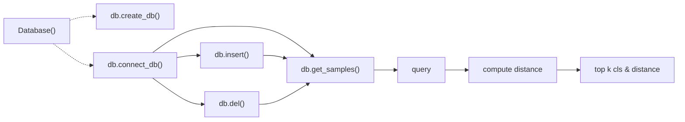

## 深想生鲜识别本地版
该项目是在beta v1 的基础上增加客户需要的8大需求，主要针对如下做了修改
```
1. csv文件+cPickle方式生成的数据文件 --> cPickle -->sqlite数据库
2. 图片名称加入md5码字段'20211115-114658WCP.png' --> '20211115-114658WCP-md5-274e909d78e5411f42685d8c2ccfbc7c.png'
一般情况下：没有md5字段的都是没加入数据库的，有的则在数据库中（我这里说的数据库与样本库是一个东西）
3. 增加查重功能，避免重复学习，实现增量学习，只有Database 类能对数据库进行增删改的操作，增量学习等价于insert操作
```

除此之外，我们希望有一个相对标准化的流程

### **移植到一台新机器的流程:**

注意事项：
1. 一般情况下系统数据应该一并移植
2. 可以将数据库一并移植，或者通过导入接口进行导入


### **恢复出厂设置的功能**

注意事项：
1. 用户希望标识用户数据和系统数据
2. 关键是保存出厂状态，有三个方式实现，我们选用第三种：
   1. 标识哪些图片是系统图片，哪些是用户图片，恢复出厂设置等价于重新利用系统图片生成样本库
   2. 新增一个出厂样本库字段，仅由第一次create_db 的时候生成。也就是说固定保存一份出厂的样本库
   3. 新增一个数据库文件，保存初始状态。当create_db时，若该文件存在则不新增，若不存在则把本次生成的数据库当作初始状态
3. 提供一个 **恢复出厂设置接口** ，实现将数据库文件替换为初始数据库文件


注意事项：
1. 数据库的逻辑是：只需进行一次 ```db.create_db()``` 构建数据库，之后只会进行增删改查的操作
2. 对于数据库的 ```insert``` 操作，根据原本flask的逻辑，我提供两种方式：
   1. 输入图片地址列表
   2. 默认从图片文件夹对比差异，得到需要增加（增量学习）的数据
3. 对于数据库的 ```del```操作，由于我还不确定客户更详细的删除需求，暂且只提供按图片删除
4. 对于数据库的 ```get_md5``` 方法，对于新的数据（未编码）进行编码并修改文件名，对于旧的数据（已经编码过）直接从图片文件名获取



### **删除功能**

支持通过如下方式进行删除：
1. 删除所有类，e.g.要删除所有苹果的特征，则输入 ```['apple'] or 'apple' ``` 

删除所有类的实现思路：
1. 先通过find方法，找到要删除的index
2. 在delete方法中，通过find方法返回的index进行删除

### **数据库中保存的项如下**

目前暂未充分考虑:
1. 区分用户数据和系统数据的问题
2. 将经常出错的特征删除

但是做了如下设定：
 1. ```data_type``` 区别用户数据和系统数据

 2. ```error_times``` 用于统计出错次数，以便后续删除经常出错的特征


```yaml
# 开始构建数据库中的项
  sample = {
      'md5': md5_code,
      'img': img,
      'cls': cls,
      'hist': query['hist'],
      'data_type': 0,  # 0 is system data , 1 is user data
      'error_times': 0  # 出错次数，默认为0
  }
```


### 快速开始


```python main_md5.py```

### 需求分析

- [ ] 移植功能
- [ ] 增量学习功能
- [ ] 输出与输入顺序有关的BUG

---

>客户有移植特征库的需求，因此我们应该考虑便捷性和鲁棒性

实现步骤：
1. 图片只会有两种：已编码 和 未编码，已编码的图片会在图片名称中增加md5字段，未编码的在经过系统之后也会被加上md5字段以避免重复编码
2. md5编码作为数据库的主键, 所有增删改查的需求都通过标准的数据库操作进行，提供给客户增删改查的接口
3. 未来需要考虑安全性和备份的需求，主要是导入导出中断导致数据库文件损毁的问题，可以通过cache来暂时解决

> 增量学习功能

实现步骤
1. 


